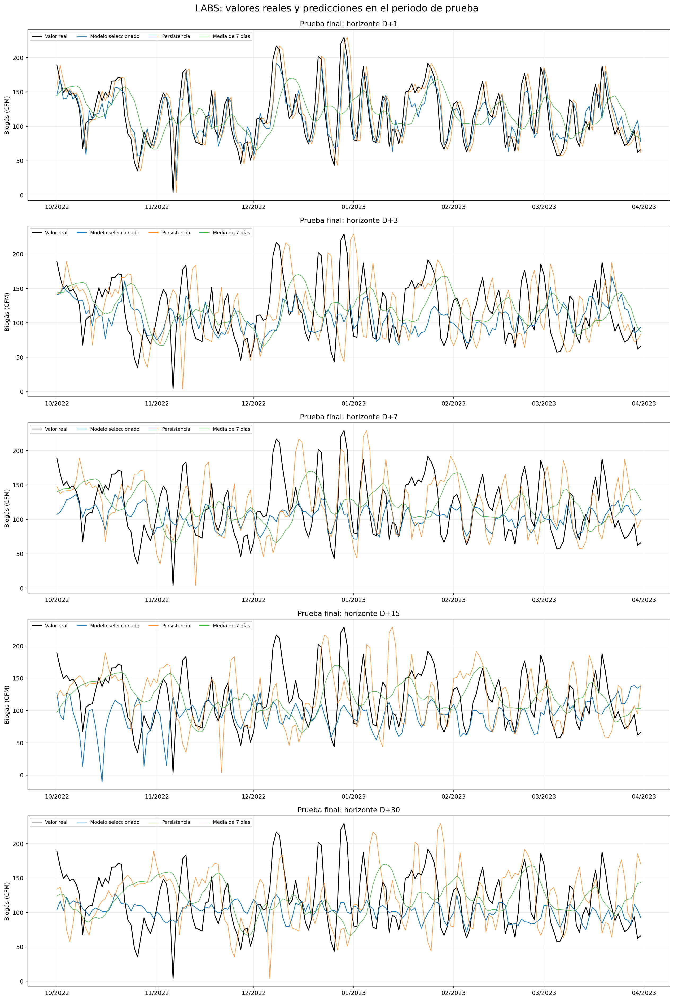
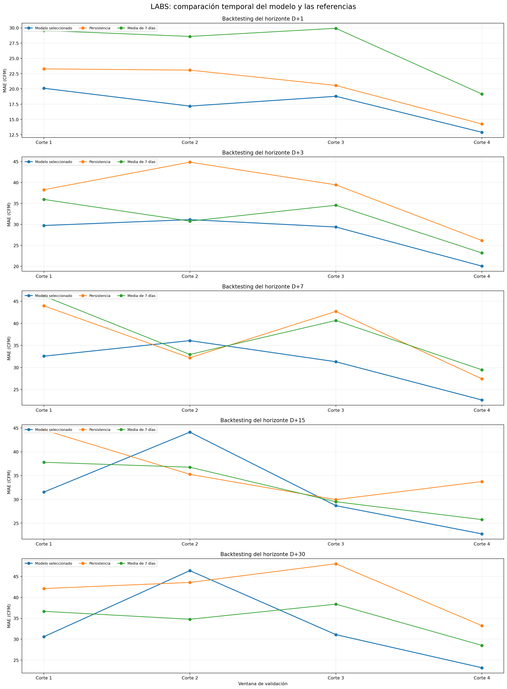

# Forecasting de la producción de biogás

Proyecto de análisis de datos y Machine Learning aplicado a una planta municipal de digestión anaerobia. El objetivo es comprobar si la información histórica de alimentación, operación y estabilidad permite anticipar el caudal medio de biogás en distintos horizontes de tiempo.



## Objetivo

El resultado principal es la predicción diaria del caudal total de biogás de la planta. Se evaluaron los horizontes **D+1, D+3, D+7, D+15 y D+30**, comparando modelos de Machine Learning con referencias sencillas como persistencia y media móvil de siete días.

El proyecto también revisa:

- La continuidad temporal y la calidad de los registros.
- La relación entre alimentación, temperatura, pH y producción de biogás.
- La utilidad de variables de laboratorio como alcalinidad, ácidos grasos volátiles y FOS/TAC.
- El comportamiento de los errores en producción baja, media y alta.
- Un experimento adicional con datos SCADA agregados por día.

## Datos

El conjunto de datos fue publicado por Hunter W. Schroer y Craig L. Just y describe la planta de recuperación de recursos hídricos de Muscatine, Iowa, entre 2020 y 2023.

- [Dataset original](https://doi.org/10.25820/data.006715)
- [Artículo científico](https://pmc.ncbi.nlm.nih.gov/articles/PMC10928704/)
- [Código de referencia de los autores](https://github.com/hunter-schroer/municipal-biogas-forecasting)

La tabla **LABS** contiene mediciones diarias de alimentación, condiciones de operación, estabilidad y caudal medio de biogás. La tabla **SCADA** contiene registros por minuto de temperaturas, caudales, niveles y distribución del biogás.

El archivo LABS y los diccionarios se incluyen por su tamaño reducido. `SCADA-raw.csv` ocupa aproximadamente 85 MB y debe descargarse desde la fuente original y guardarse en `data/raw/SCADA-raw.csv` antes de ejecutar el notebook completo.

## Metodología

1. Revisión de la documentación, tipos de datos, ausentes, duplicados y continuidad temporal.
2. Análisis gráfico del biogás, alimentación y condiciones de estabilidad.
3. Tratamiento de valores ausentes sin rellenar el hueco temporal principal.
4. Creación de retardos, medias móviles y objetivos para cinco horizontes.
5. Separación cronológica de entrenamiento, validación y prueba.
6. Comparación de Regresión Lineal, Random Forest, HistGradientBoosting y XGBoost.
7. Evaluación frente a persistencia y media de siete días.
8. Interpretación de errores, importancia de variables y exportación para Power BI.

## Resultados principales

- **D+1 es el horizonte más confiable.** En la prueba final obtuvo un MAE de **20,58 CFM**, un R² de **0,60** y una mejora del **17,4 %** frente a persistencia.
- El backtesting temporal confirma el resultado de D+1: MAE medio de **17,24 CFM**, frente a **20,29 CFM** de persistencia y **26,81 CFM** de la media de siete días.
- D+3 conserva cierta utilidad, pero representa peor los cambios diarios.
- D+7, D+15 y D+30 son experimentales y presentan una estabilidad menor entre periodos.
- Los modelos tienden a sobreestimar los niveles bajos y a subestimar los picos de producción.
- Las variables de laboratorio pueden aportar información, pero su uso operativo depende de que los resultados estén disponibles al momento de pronosticar.
- XGBoost fue evaluado, pero una mayor complejidad no produjo automáticamente mejores resultados.

## Notebook principal y anexo

- [`Forecasting_Biogas_Production.ipynb`](notebooks/Forecasting_Biogas_Production.ipynb): desarrollo principal, desde el EDA hasta la evaluación final y la exportación para Power BI.
- [`Anexo_A_Backtesting_Temporal.ipynb`](notebooks/Anexo_A_Backtesting_Temporal.ipynb): versión ampliada que conserva el trabajo principal y añade el **Anexo A**, con ventanas expansivas, comparación real frente a predicho y diagnóstico de errores por nivel de producción.

El anexo sirve para comprobar si los resultados se mantienen en distintos periodos. No sustituye el análisis principal.



## Tablas para Power BI

`data/processed/` contiene las tablas preparadas para construir el dashboard:

- Operación diaria.
- Predicciones del periodo de prueba.
- Métricas de modelos.
- Calidad de los datos.
- Calendario y diccionario de variables.
- Resultados adicionales del backtesting.

## Estructura del repositorio

```text
.
|-- data/
|   |-- raw/                 # LABS, diccionarios y documentación original
|   `-- processed/           # Tablas preparadas para Power BI
|-- images/                  # Gráficos principales y del anexo
|-- notebooks/
|   |-- Forecasting_Biogas_Production.ipynb
|   `-- Anexo_A_Backtesting_Temporal.ipynb
|-- .gitignore
|-- README.md
`-- requirements.txt
```

## Instalación y ejecución

```bash
python -m venv .venv

# Windows
.venv\Scripts\activate

pip install -r requirements.txt
jupyter notebook
```

Para ejecutar el análisis completo, descarga primero `SCADA-raw.csv` y colócalo en `data/raw/`. Los notebooks utilizan rutas relativas y pueden abrirse desde la carpeta `notebooks/` o desde la raíz del repositorio.

## Limitaciones

- El caudal de biogás está registrado para toda la planta, no por digestor.
- No existe una medición de concentración de metano, por lo que no se estima CH₄ mediante porcentajes supuestos.
- Existe una interrupción prolongada en LABS que se conserva como ausencia real de información.
- Los resultados de laboratorio no se midieron diariamente y su fecha no garantiza disponibilidad inmediata.
- Las predicciones de horizontes largos suavizan la serie y pierden parte de los picos operativos.

